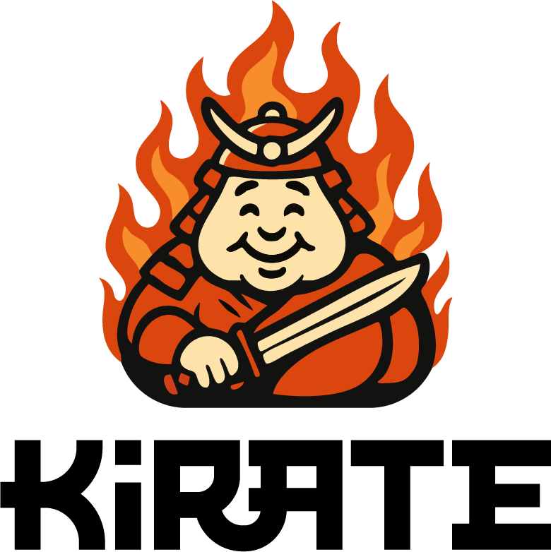

<div align="center">
  

  [](https://opensource.org/licenses/MIT)
  [](https://www.python.org/downloads/)
  [](https://kirate.readthedocs.io/)
  [](https://github.com/tdinelli/KiRATE/actions/workflows/ci.yml)
  [](https://codecov.io/gh/tdinelli/KiRATE)
</div>

**KiRATE** (**Ki**netic **R**ate **A**nalysis and **T**uning **E**nvironment) is a gradient processing and kinetic analysis library for JAX, designed to facilitate research in chemical reaction kinetics, specifically designed for the oxidation and pyrolysis. KiRATE was developed by [Timoteo Dinelli](https://github.com/tdinelli) at the [CRECK Modeling Lab](https://creckmodeling.polimi.it/), Politecnico di Milano.

---

## Features

KiRATE provides a comprehensive suite of composable building blocks for working with chemical reaction kinetics:

- **Temperature-dependent rate constants**: Arrhenius, Reparametrized Arrhenius
- **Pressure-dependent rate constants**: PLOG, FallOff (Lindemann, Troe, SRI), CABR, Chebyshev
- **Mixture rules**: LMR-P and LMR-R for multi-collider reactions
- **Three-body reactions**: Configurable third-body efficiencies
- **Fully differentiable**: Built on JAX for automatic differentiation and gradient-based optimization
- **CHEMKIN/Cantera compatible**: Read and evaluate mechanisms from standard formats
- **Uncertainty quantification**: Propagate uncertainties through kinetic calculations
- **Rate constant refitting**: Optimize parameters to match experimental or computational data
- **Composable design**: Mix and match components to build custom kinetic models

## Installation

### From PyPI
```bash
pip install KiRATE
```

### From GitHub (latest development version)

```bash
pip install git+https://github.com/tdinelli/KiRATE.git
```

## Quick Start

### TROE FallOff Rate Constant with Third-Body Efficiencies

```python
from KiRATE.kinetics import FallOff

reaction = FallOff(
    name               = "CH3+CH3(+M)=C2H6(+M)",
    falloff_type       = "troe",
    hpl_parameters     = {"A": 9.030E+16, "n": -1.180, "Ea": 654.00},
    lpl_parameters     = {"A": 3.180E+41, "n": -7.030, "Ea": 2762.00},
    falloff_parameters = {"A": 0.6041, "T3": 6927, "T1": 132.00, "T2": 2762.00},
    efficiencies       = {"H2": 2, "CO": 2, "CO2": 3, "H2O": 5},
)

k = reaction.rate_constant(T=1000.0, P=1.0)
print(f"k(1000 K, 1 atm) = {k:.3e} cm³/mol/s")
```

### PLOG Rate Constants

```python
from KiRATE.kinetics import Plog

plog = Plog(
  name       = "OH+NO=HONO"
  parameters = {
    0.01:  {"A": 5.02e21, "n": -4.24, "Ea": 898.9},
    1.0:   {"A": 3.09e23, "n": -4.17, "Ea": 1621.0},
    100.0: {"A": 7.29e22, "n": -3.41, "Ea": 2660.0},
  }
)

k = plog.rate_constant(T=1500.0, P=10.0)
print(f"k(1500 K, 10 atm) = {k:.3e}")
```

## Documentation

Full documentation is available at: [https://kirate.readthedocs.io/](https://kirate.readthedocs.io/)

- [Installation Guide](https://kirate.readthedocs.io/getting-started/installation.html)
- [Quickstart Tutorial](https://kirate.readthedocs.io/getting-started/quickstart.html)
- [API Reference](https://kirate.readthedocs.io/api/kinetics.html)
- [Examples](https://kirate.readthedocs.io/examples/basic.html)

## Citation

If you use KiRATE in your research, please cite:

```bibtex
@software{kirate2025,
  author = {Dinelli, Timoteo},
  title = {KiRATE: Kinetic Rate Analysis and Tuning Environment},
  year = {2025},
  publisher = {GitHub},
  url = {https://github.com/tdinelli/KiRATE}
}
```

## Contributing

Contributions are welcome! Please see [CONTRIBUTING.md](docs/contributing.md) for guidelines.

## Bonus

**Want a cool logo like ours?** Contact [Alessia Contessi](https://alessiacontessi.framer.website/) for professional design services.

## License

MIT License - see [LICENSE](LICENSE) file for details.